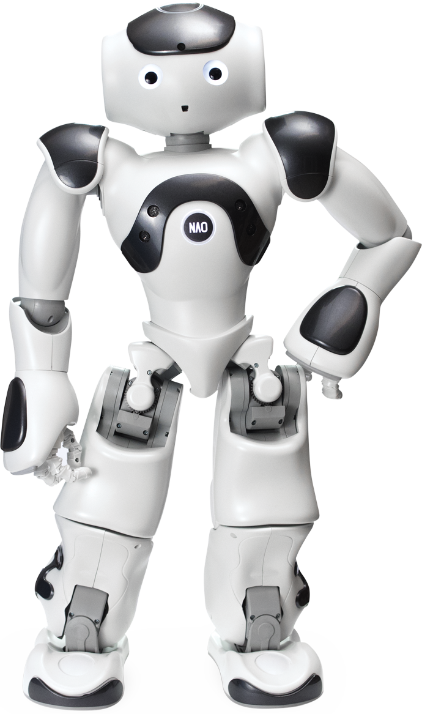
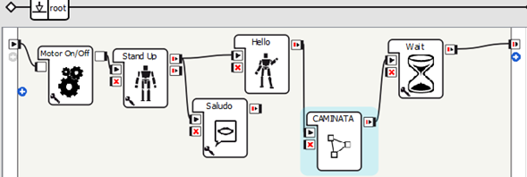
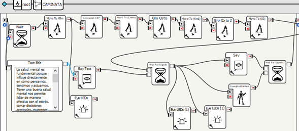

<h1 align="center">
    
  <b>NAO</b>
</h1>

<b>Personal Project • Test Robot NAO • English/Español</b>  

### NAO-Move-walk
`Eng`

This practice focuses on movements with the NAO robot, specifically walking, turning, and managing wait times. A presentation routine was developed that includes a brief conversation, specific movements, and a light walk with turns.

`Esp`

Práctica de movimientos con el robot NAO, enfocada en caminar, girar y gestionar tiempos de espera. Se desarrolló una rutina de presentación que incluye una charla breve, movimientos específicos y una ligera caminata con giros.

________________________________________
### Project Objective
`Eng`

Practice optimizing the best walking environment for the robot, while relating the displacement distance and execution times.

`Esp`

Poner en práctica el mejor ambiente para caminar del robot, optimizando la distancia de desplazamiento y los tiempos de ejecución.
